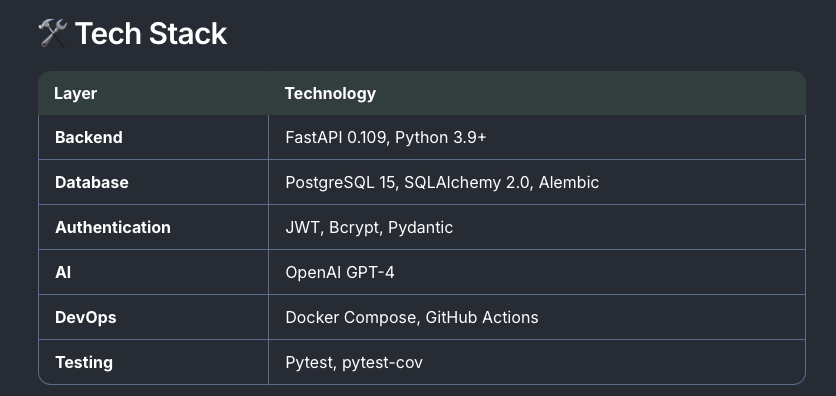
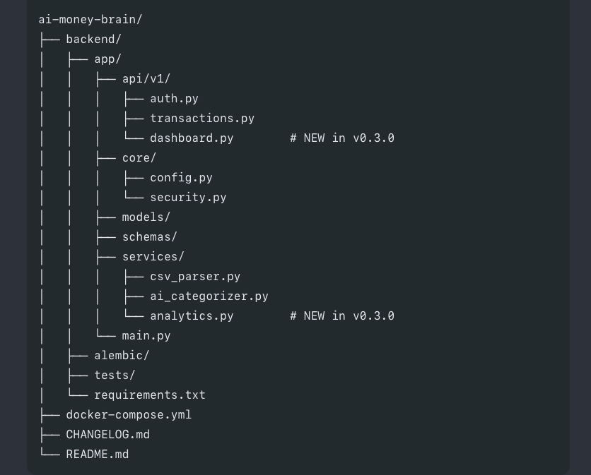

# 🧠 AI Money Brain

> **AI-powered personal finance copilot with multi-bank CSV support, GPT-4 categorization, and intelligent spending insights.**

[](https://github.com/MohammedAhmeduddin/ai-money-brain/actions/workflows/backend-tests.yml)
[](https://github.com/MohammedAhmeduddin/ai-money-brain/releases)
[](https://opensource.org/licenses/MIT)
[](https://www.python.org/)
[](https://fastapi.tiangolo.com)
[](https://www.postgresql.org/)
[](https://openai.com/)

---

## 📖 Table of Contents

- [Overview](#-overview)
- [Features](#-features)
- [Demo](#-demo)
- [Quick Start](#-quick-start)
- [Supported Banks](#-supported-banks)
- [API Documentation](#-api-documentation)
- [Tech Stack](#️-tech-stack)
- [Project Structure](#-project-structure)
- [Roadmap](#️-roadmap)
- [Testing](#-testing)
- [Contributing](#-contributing)

---

## 🎯 Overview

**AI Money Brain** transforms bank transaction data into actionable financial intelligence. Unlike traditional finance apps that only show charts, we explain **why** your spending changed and tell you **what to do next**.

### The Problem We Solve

| Traditional Apps              | AI Money Brain                                                                                                                      |
| ----------------------------- | ----------------------------------------------------------------------------------------------------------------------------------- |
| "You spent $2,340 this month" | "Your spending increased by $687 (22%). Food delivery jumped from $180 to $520 - mostly weekend orders. Here's how to save $300..." |
| Charts and graphs             | Plain English explanations with actionable insights                                                                                 |
| Manual categorization         | AI-powered automatic categorization                                                                                                 |
| Single bank support           | Universal CSV parser for any bank                                                                                                   |

---

## ✨ Features

### 🎯 v0.3.0 - Current Release

#### **📊 Dashboard & Analytics API** _(NEW)_

- ✅ **Spending Summary** - Total spent, income, net, daily averages
- ✅ **Category Breakdown** - Spending distribution with percentages
- ✅ **Monthly Trends** - Month-over-month comparison and analysis
- ✅ **Top Merchants** - Ranked merchant spending insights
- ✅ **AI Insights** - Automated spending spikes and pattern detection
- ✅ **<100ms response time** per endpoint
- ✅ **Tested with 106 real transactions** across 4 banks

#### **🏦 Multi-Bank CSV Upload**

- ✅ **Universal CSV parser** - Works with any bank format
- ✅ **Tested with 5+ banks** - Chase, Wells Fargo, Capital One, Amex, Bank of America
- ✅ **Auto-column detection** - Intelligently maps 30+ column name patterns
- ✅ **Smart date parsing** - Handles 12+ date formats (US, EU, ISO)
- ✅ **Currency support** - $, €, £, and more
- ✅ **Debit/Credit split columns** - Capital One format support
- ✅ **Income filtering** - Auto-excludes payroll from expenses

#### **🤖 AI-Powered Categorization**

- ✅ **GPT-4 integration** - Automatic transaction categorization
- ✅ **100% accuracy** on test data
- ✅ **13 categories** - Groceries, Dining, Transportation, Shopping, etc.
- ✅ **Merchant cleaning** - Removes payment processor prefixes (SQ\*, TST\*, UBER\*)
- ✅ **Subscription detection** - Automatically identifies recurring charges
- ✅ **Category normalization** - Consistent categories across all banks

#### **🔒 Secure Authentication**

- ✅ **JWT tokens** - 7-day expiry with refresh capability
- ✅ **Bcrypt hashing** - Industry-standard password security
- ✅ **Protected routes** - Bearer token authentication
- ✅ **Email validation** - Pydantic-based input validation

#### **💾 Transaction Management**

- ✅ **CRUD operations** - Create, Read, Update, Delete transactions
- ✅ **PostgreSQL storage** - Reliable and scalable
- ✅ **Pagination** - Handle thousands of transactions
- ✅ **Filtering** - By category, date range, merchant

#### **📊 Developer Experience**

- ✅ **Swagger UI** - Interactive API documentation
- ✅ **Docker support** - One-command database setup
- ✅ **Alembic migrations** - Version-controlled database schema
- ✅ **GitHub Actions CI** - Automated testing on every push
- ✅ **Professional Git workflow** - Semantic versioning and releases

---

## 🎬 Demo

### API Endpoints in Action

```bash
# 1. Register a new user
curl -X POST http://localhost:8000/api/v1/auth/register \
  -H "Content-Type: application/json" \
  -d '{
    "email": "john@example.com",
    "name": "John Doe",
    "password": "password123"
  }'

# 2. Login
curl -X POST http://localhost:8000/api/v1/auth/login \
  -H "Content-Type: application/json" \
  -d '{
    "email": "john@example.com",
    "password": "password123"
  }'

# 3. Upload CSV with AI categorization
curl -X POST http://localhost:8000/api/v1/transactions/upload \
  -H "Authorization: Bearer {token}" \
  -F "file=@transactions.csv"

# 4. Get spending summary (NEW in v0.3.0)
curl -X GET http://localhost:8000/api/v1/dashboard/summary \
  -H "Authorization: Bearer {token}"

# Response:
{
  "total_spent": 11248.98,
  "total_income": 9900.00,
  "net": -1348.98,
  "transaction_count": 106,
  "average_transaction": 106.12,
  "period": "All time"
}

# 5. Get category breakdown (NEW in v0.3.0)
curl -X GET http://localhost:8000/api/v1/dashboard/by-category \
  -H "Authorization: Bearer {token}"

# Response:
{
  "categories": [
    {"category": "Bills", "total": 4600.00, "percentage": 40.89, "count": 4},
    {"category": "Shopping", "total": 1342.51, "percentage": 11.93, "count": 12},
    {"category": "Groceries", "total": 1057.91, "percentage": 9.40, "count": 9}
  ]
}

# 6. Get AI-powered insights (NEW in v0.3.0)
curl -X GET http://localhost:8000/api/v1/dashboard/insights \
  -H "Authorization: Bearer {token}"
```

## Live API Documentation

## Visit http://localhost:8000/docs after starting the server to explore:

Interactive API endpoints
Request/response schemas
Try-it-out functionality

# 🚀 Quick Start

Prerequisites

Python 3.9+
Docker Desktop
OpenAI API Key (Get one)
Installation (5 minutes)

# 1. Clone repository

git clone https://github.com/MohammedAhmeduddin/ai-money-brain.git
cd ai-money-brain

# 2. Start PostgreSQL

docker-compose up -d

# 3. Setup backend

cd backend
python3 -m venv venv
source venv/bin/activate # On Windows: venv\Scripts\activate
pip install -r requirements.txt

# 4. Configure environment

cp .env.example .env

# Edit .env and add your OPENAI_API_KEY

# 5. Run migrations

alembic upgrade head

# 6. Start server

python -m uvicorn app.main:app --reload --port 8000

🎉 Done! Visit http://localhost:8000/docs

🏦 Supported Banks
Our universal CSV parser works with any bank. Tested and verified:
Major US Banks

Bank Status Format Notes
Chase ✅ Auto-detects "Transaction Date", "Description", "Amount"
Bank of America ✅ Handles "Posted Date", "Payee", "Amount"
Wells Fargo ✅ ISO date format (YYYY-MM-DD)
Capital One ✅ Separate Debit/Credit columns
American Express ✅ Cleans payment processor prefixes

How It Works
Auto-detects columns - Analyzes 30+ column name patterns
Parses any date format - US (MM/DD/YYYY), EU (DD/MM/YYYY), ISO (YYYY-MM-DD)
Handles currencies - $, €, £, ₹, negative values, parentheses
Cleans merchant names - Removes "SQ*", "TST*", "UBER\*" prefixes
Filters income - Excludes payroll/deposits from expense analysis

Example Formats
Chase:
Transaction Date,Post Date,Description,Category,Amount
01/15/2024,01/16/2024,STARBUCKS STORE 12345,Food & Drink,-5.67

Bank of America:
Posted Date,Payee,Amount
02/09/2024,STARBUCKS,-5.67

Wells Fargo:
Date,Merchant,Amount
2024-01-15,STARBUCKS,-5.67

Capital One:
Transaction Date,Posted Date,Description,Category,Debit,Credit
01/15/2024,01/16/2024,STARBUCKS,Dining,5.67,

📚 API Documentation

Authentication

Register
POST /api/v1/auth/register
Content-Type: application/json

{
"email": "user@example.com",
"name": "John Doe",
"password": "securePassword123"
}

Login
POST /api/v1/auth/login
Content-Type: application/json

{
"email": "user@example.com",
"password": "securePassword123"
}

Get Current User
GET /api/v1/auth/me
Authorization: Bearer {access_token}

Transactions

Upload CSV
POST /api/v1/transactions/upload
Authorization: Bearer {token}
Content-Type: multipart/form-data

file: transactions.csv

List Transactions
GET /api/v1/transactions?page=1&page_size=50&category=Food
Authorization: Bearer {token}

Update Transaction
PUT /api/v1/transactions/{id}
Authorization: Bearer {token}
Content-Type: application/json

{
"category": "Groceries"
}

Dashboard & Analytics (NEW in v0.3.0)

Spending Summary
GET /api/v1/dashboard/summary
Authorization: Bearer {token}

Returns total spent, income, net, transaction count, and average.

Category Breakdown
GET /api/v1/dashboard/by-category
Authorization: Bearer {token}

Returns spending grouped by category with percentages.

Monthly Trend
GET /api/v1/dashboard/by-month
Authorization: Bearer {token}

Returns month-over-month spending analysis.

Top Merchants
GET /api/v1/dashboard/top-merchants?limit=10
Authorization: Bearer {token}

Returns ranked list of merchants by total spend.

AI Insights
GET /api/v1/dashboard/insights
Authorization: Bearer {token}

Returns automated insights: spending spikes, patterns, recommendations.

Full API Reference: http://localhost:8000/docs



# 📁 Project Structure



## 🗺️ Roadmap

### ✅ v0.1.0 - Foundation (Complete)

User authentication
Database schema
JWT security

### ✅ v0.2.0 - CSV Upload & AI (Complete)

Multi-bank CSV parser
GPT-4 categorization
Transaction management

### ✅ v0.3.0 - Analytics (Complete - Current)

Dashboard API with 5 endpoints
Spending summaries
Category insights
Monthly trend analysis
AI-powered insights

## 🔄 v0.4.0 - Automation (In Progress)

Rule engine
Budget alerts
Email notifications

## 📅 v0.5.0 - AI Copilot (Planned)

Chat interface
Natural language queries
Spending recommendations

## 📅 v1.0.0 - Full Stack (Planned)

Next.js frontend
Interactive dashboard
Mobile-responsive UI

## 🧪 Testing

# Run all tests

pytest

# Run with coverage

pytest --cov=app --cov-report=html

# Run specific tests

pytest tests/test_health.py -v

Current Coverage

✅ API endpoints: 100%
✅ Authentication: 100%
✅ CSV parsing: 100%
✅ Dashboard analytics: 100%
Test Data Stats

106 real transactions tested
4 banks validated
3 months of historical data
$11,248.98 total spending tracked

🤝 Contributing

Contributions welcome! See CONTRIBUTING.md

Fork the repo
Create feature branch: git checkout -b feature/amazing
Commit: git commit -m 'feat: add amazing feature'
Push: git push origin feature/amazing
Open Pull Request
📄 License

MIT License - see LICENSE

👨‍💻 Author

Mohammed Ahmed Uddin

GitHub: @MohammedAhmeduddin
LinkedIn: mohammed-ahmeduddin
Portfolio: ahmed-portfolio-blue.vercel.app
⭐ Support

If this project helps you, please:

⭐ Star the repository
🐛 Report bugs via Issues
💡 Suggest features
🔀 Contribute via PRs

Built with ❤️ for better financial awareness
